# MD3Music - Material Design 3 音乐播放器

<div align="center">

[](https://flutter.dev)
[]()
[](LICENSE)

</div>

MD3Music 是一款基于酷狗音乐 API 的 Flutter 音乐播放器，内置嵌入式 Rust API 服务器，无需外部服务器即可使用。支持手机/平板自适应，提供 MD3 以及 Apple Music 风格播放页与逐字歌词，并通过 LaunchPad 导航聚合编辑精选、听书、场景音乐、频道等多种功能。本项目仅供学习，请勿用于商业用途，详情见[免责声明](DISCLAIMER.md)。

> **版本说明**：V5 之前的所有版本与分支均已废弃并彻底删除，请勿使用过时版本。最新版请前往 [GitHub Releases](https://github.com/zzyoxml/md3Music/releases)。
> 
> 由于私有库开发同步会覆盖公开库代码，公开库代码现由脚本全量推送至公开库 `rust-local-force` 分支。
> 
> **投屏功能声明**：投屏采用行业标准的通用传输协议（DLNA/AirPlay），仅用于在个人家庭网络内将音乐流转至用户本人合法拥有的播放设备，不涉及对音乐文件的再存储、分发或向公众传播。
>
> 请勿用于公共场所播放或多人同步观看场景，否则由此引发的一切法律责任由使用者自行承担。

***

## 📈 GitHub Star 趋势

<p align="center">
  <a href="https://kaiyuanbang.cn/zh-cn/repo/zzyoxml-md3music.html">
    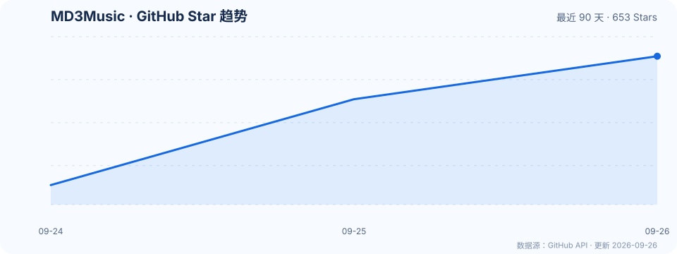
  </a>
</p>

> 数据由 GitHub Actions 每日从[开源榜项目页](https://kaiyuanbang.cn/zh-cn/repo/zzyoxml-md3music.html)同步，图表展示该页面提供的最近 90 天 Star 快照。

***

## ✨ 功能特性

- **在线音乐** — 搜索、每日推荐、排行榜、私人 FM、歌单/专辑/歌手/评论/MV、云盘、听书、场景音乐、频道、刷刷短视频
- **本地音乐** — 文件夹浏览、内嵌封面与歌词、本地收藏、音质标签、多维度排序
- **播放体验** — 多音质选择（标准/高质/无损/Hi-Res）、USB 独占输出、均衡器、DLNA 投屏、睡眠定时、倍速、进度记忆、画中画
- **歌词** — Apple Music 风格逐字歌词（KRC/LRC），支持翻译/罗马音、辉光、模糊、动态取色，以及桌面/锁屏/蓝牙歌词与 SuperLyric 推送
- **状态栏歌词** — 魅族 Flyme 机型可将当前歌词显示在状态栏，支持提前量微调
- **用户中心** — VIP 双签到、多账号管理、听歌等级/排行/识曲、收藏与播放历史、桌面小组件
- **个性化** — MD3/AM 双风格、主题色与动态取色、深色模式、全局背景图、桌面歌词、主页 Tab 自定义、设置搜索

***

## 🏗️ 架构说明

### 本地架构

```
┌───────────────────────────────────────────────────────────────┐
│                       MD3Music App                             │
│   ┌───────────────────────┐      ┌─────────────────────────┐    │
│   │    Flutter UI (Dart)  │      │  嵌入式 Rust API 服务器 │    │
│   │                       │      │     (127.0.0.1)         │    │
│   └───────────┬───────────┘      └───────────┬─────────────┘    │
│               │              JNI / FFI       │                  │
│               └─────────────────┬────────────┘                  │
│                                 ▼                               │
│              ┌──────────────────────────────────┐               │
│              │         本地数据 / 缓存            │               │
│              └──────────────────────────────────┘               │
└───────────────────────────────────────────────────────────────┘
```

### 核心特点

- **嵌入式 Rust 服务器** — App 启动时通过 `libkugou_server.so`（JNI/MethodChannel）启动本地 tiny\_http 服务器（`127.0.0.1`），所有酷狗 API 请求在本地处理
- **高性能低资源** — Rust 实现取代旧 Node.js 方案，内存占用更低，启动更快
- **无需外部服务器** — 用户无需自行搭建 API 服务器
- **多架构支持** — 支持 armeabi-v7a（32 位）、arm64-v8a（64 位）、x86、x86\_64（模拟器）
- **本地投屏支持** — 内置局域网 HTTP 服务器（支持 Range 请求），本地音乐也能投屏到 DLNA 设备

***

## 🔄 CI/CD

项目已配置 GitHub Actions 自动构建，推送 `v*` 标签即可触发：

- 自动构建 3 个架构的 APK（arm64-v8a、armeabi-v7a、x86\_64）
- 自动创建 GitHub Release 并上传产物
- 自动递增 versionCode 并生成 Changelog（优先使用 CHANGELOG.md 中对应版本说明）

***

## 📷 界面预览

### 手机 · Material Design 3

<p align="center">
  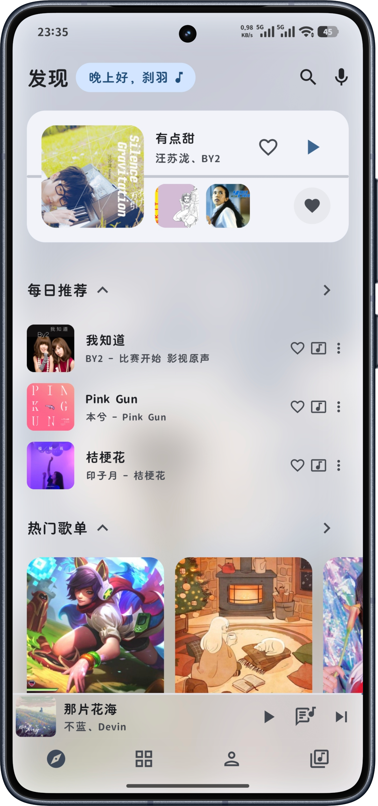
  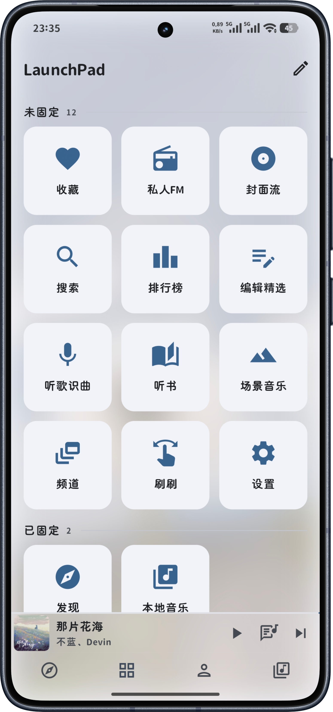
  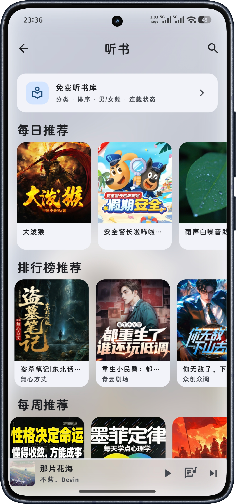
</p>

### 手机 · Apple Music 风格

<p align="center">
  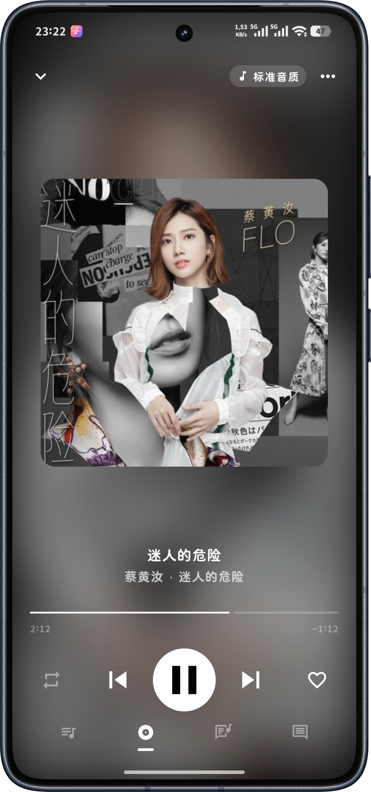
  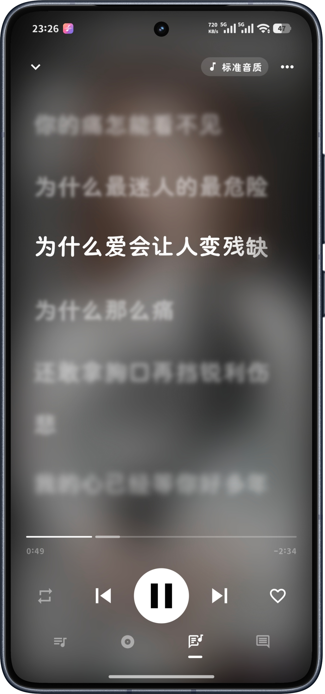
  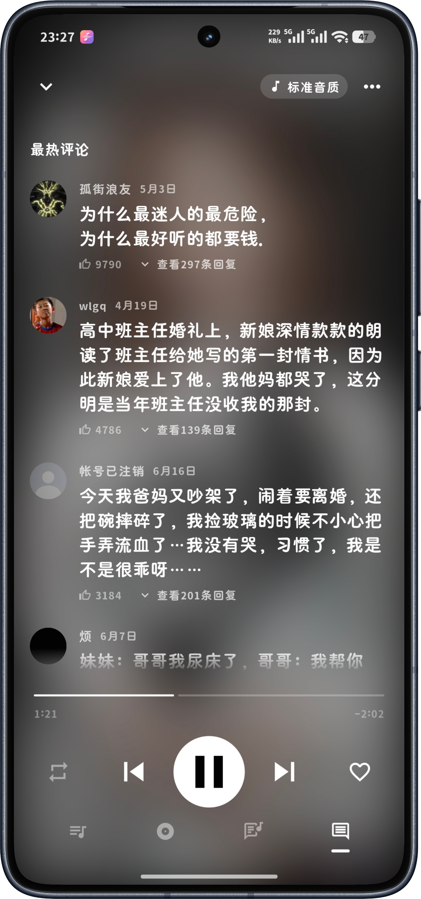
</p>

### 手机 · 更多界面(夜间和横屏)

<p align="center">
  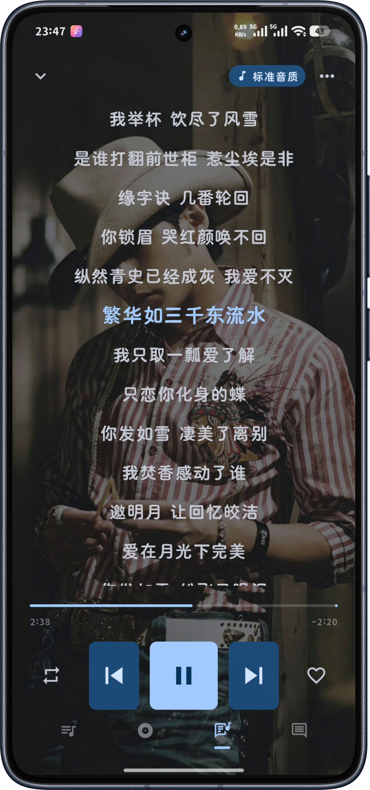
  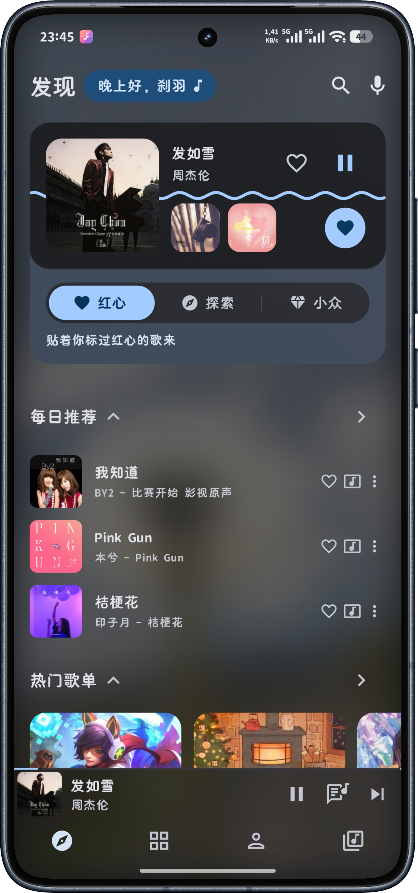
  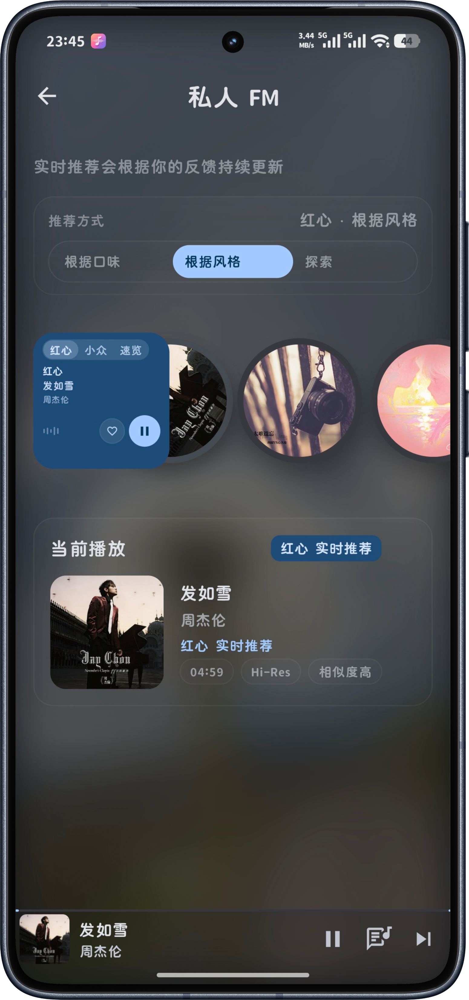
</p>

<p align="center">
  
</p>

### 平板 · Material Design 3

<p align="center">
  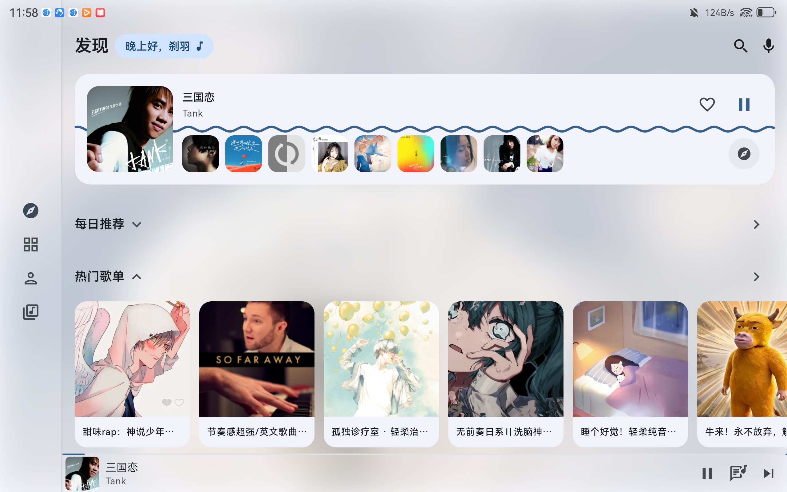
  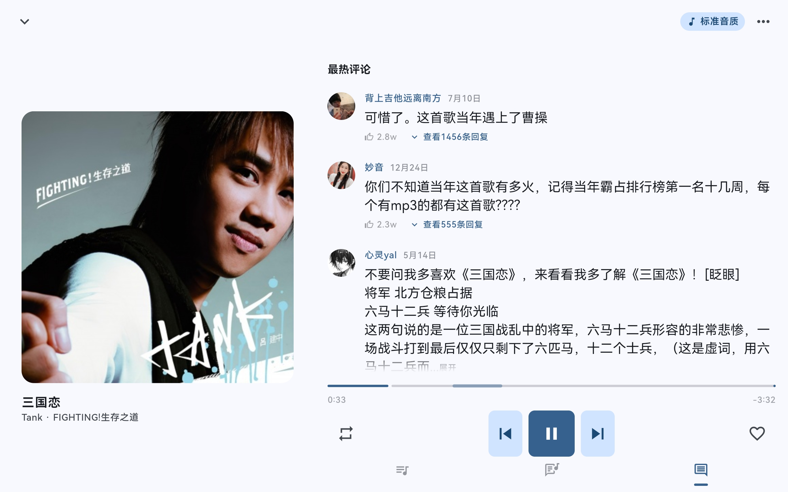
</p>

### 平板 · Apple Music 风格(横屏 和 zen沉浸模式)

<p align="center">
  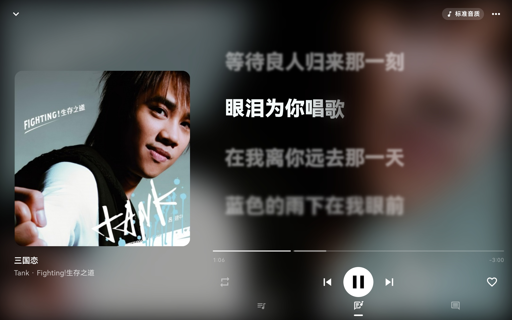
  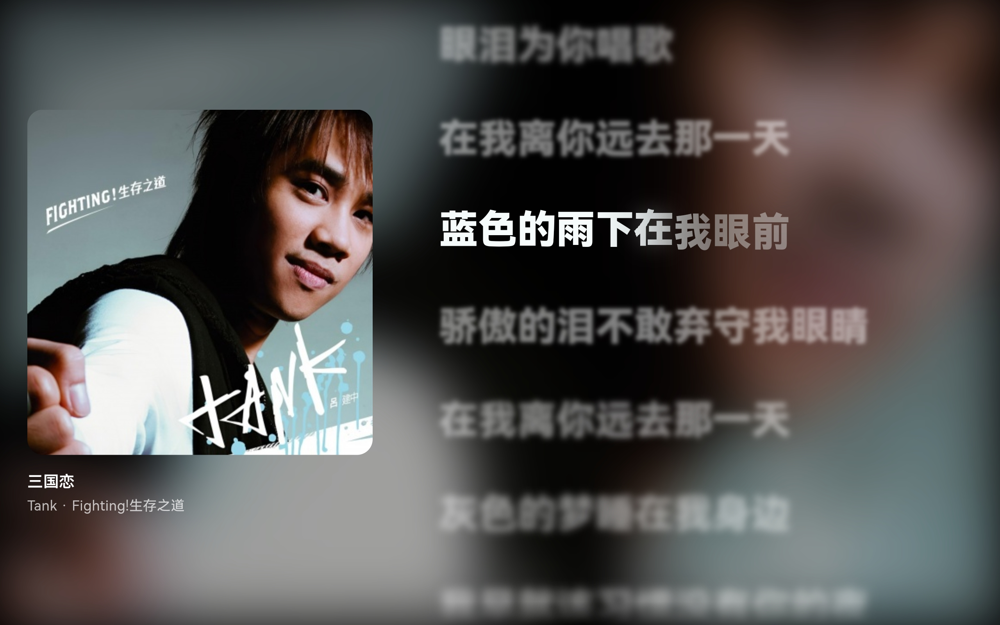
</p>

### Flyme 状态栏歌词

<p align="center">
  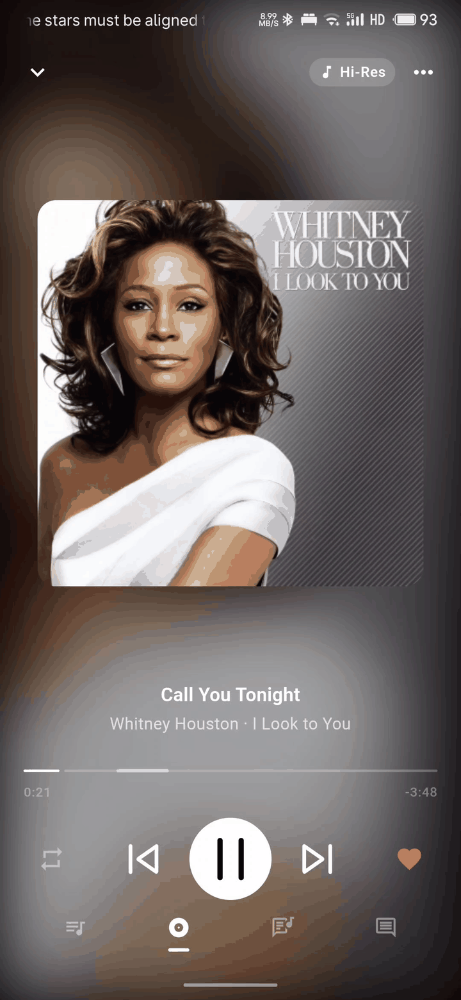
  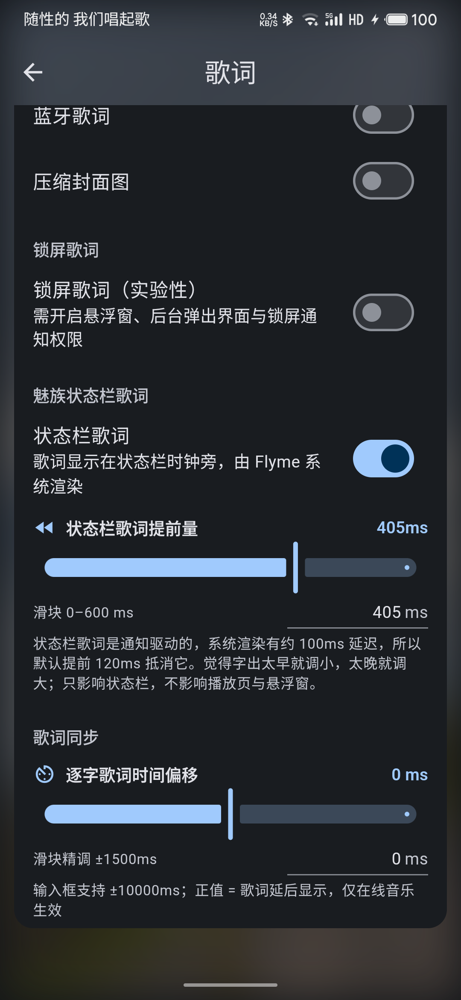
</p>

### 🚀 快速开始

### 前置要求

- **Flutter SDK** 3.12.0 或更高版本
- **Rust** 1.70+（用于构建嵌入式 API 服务器，若使用已提交的 `.so` 可跳过）
- **Android Studio** / VS Code
- **Android NDK** 28（用于 Rust 交叉编译）

### 1. 克隆项目

```bash
git clone https://github.com/zzyoxml/md3Music.git
cd md3Music
```

### 2. 安装 Flutter 依赖

```bash
flutter pub get
```

### 3. 构建 Rust 服务器（可选）

`libkugou_server.so` 已提交进 Git 仓库，通常无需重新编译。仅当你修改了 `kugou_api_server/rust/src/` 下的代码时才需要重建：

```bash
# 主机编译验证
cd kugou_api_server/rust
cargo build --release

# 安卓交叉编译（4 个 ABI，需要 NDK）
./build_android.sh
```

### 4. 运行应用（调试模式）

```bash
# 连接 Android 设备后执行
flutter run
```

### 5. 构建发布版 APK

```bash
# 构建三个架构的 APK（分拆包）
flutter build apk --release --split-per-abi

# 输出位置：
# build/app/outputs/flutter-apk/app-armeabi-v7a-release.apk  (32 位)
# build/app/outputs/flutter-apk/app-arm64-v8a-release.apk   (64 位)
# build/app/outputs/flutter-apk/app-x86_64-release.apk      (模拟器)
```

***

## 📁 项目结构

```
md3Music/
├── lib/                        # Flutter 应用代码
│   ├── main.dart               # 应用入口
│   ├── app.dart                # 主应用组件
│   ├── core/                   # 核心模块
│   │   ├── layout/             # 响应式布局
│   │   ├── services/           # 平台服务（音频/USB 独占/均衡器/DLNA 投屏/频谱/桌面歌词/词幕/小组件）
│   │   ├── theme/              # 主题配置
│   │   └── utils/              # 工具类
│   ├── data/                   # 数据层
│   │   ├── models/             # 数据模型
│   │   └── repositories/       # 数据仓库（设置/收藏/历史）
│   ├── modules/                # 功能模块
│   │   ├── home/               # 主页（每日推荐等）
│   │   ├── launchpad/          # LaunchPad 导航
│   │   ├── discover/           # 发现页
│   │   ├── charts/             # 排行榜
│   │   ├── coverflow/          # 封面流（CoverFlow 3D）
│   │   ├── player/             # 播放器（含评论视图/MV 播放）
│   │   ├── playlist/           # 歌单详情
│   │   ├── search/             # 搜索
│   │   ├── album/              # 专辑详情
│   │   ├── artist/             # 歌手详情
│   │   ├── personal_fm/        # 私人 FM
│   │   ├── ip/                 # 编辑精选
│   │   ├── audiobook/          # 听书
│   │   ├── scene/              # 场景音乐
│   │   ├── channel/            # 频道
│   │   ├── brush/              # 刷刷（竖屏视频流）
│   │   ├── user/               # 用户中心（签到/收藏/历史/听歌排行）
│   │   ├── library/            # 音乐库（本地音乐/云盘）
│   │   ├── settings/           # 设置（含均衡器）
│   │   ├── login/              # 登录
│   │   ├── onboarding/         # 新手引导
│   │   └── recognition/        # 听歌识曲
│   ├── providers/              # 状态管理
│   ├── services/               # 服务层（本地 API 客户端 / 服务器启动）
│   └── widgets/                # 公共组件
│       └── apple_lyrics/       # Apple Music 风格歌词
├── kugou_api_server/           # 嵌入式 Rust API 服务器
│   ├── rust/                   # Rust crate（tiny_http + ureq）
│   │   ├── src/
│   │   │   ├── lib.rs          # FFI/JNI 导出符号
│   │   │   ├── server.rs       # HTTP 服务器：路由分发、CORS、缓存
│   │   │   ├── modules/        # 160+ 个 API 模块
│   │   │   ├── crypto.rs       # MD5/SHA1/AES/RSA 加密
│   │   │   ├── request.rs      # 上游转发（ureq）
│   │   │   └── device.rs       # 设备信息持久化
│   │   ├── tests/smoke.rs      # 本地冒烟测试
│   │   ├── build_android.sh    # 一键交叉编译脚本
│   │   └── Cargo.toml
│   └── module/                 # 旧 JS 模块（已废弃，仅供参考）
├── img/                        # 界面预览截图（README 用）
│   ├── phone/                  # 手机：md3 / applemusic / other
│   └── pad/                    # 平板：md3 / applemusic / other
├── assets/                     # 资源文件
│   ├── images/                 # 图片资源
│   └── fonts/                  # 字体文件
├── android/                    # Android 平台配置
│   └── app/src/main/
│       ├── cpp/                # USB 独占输出 C++ 驱动（CMake）
│       ├── kotlin/             # KugouApiService（启动本地服务器）/ MainActivity
│       └── jniLibs/            # libkugou_server.so（四个架构）
└── pubspec.yaml                # Flutter 配置
```

***

## 🛠️ 技术栈

| 类别           | 技术                                                               |
| ------------ | ---------------------------------------------------------------- |
| **UI 框架**    | Flutter 3.12+                                                    |
| **状态管理**     | Provider                                                         |
| **动效**       | m3e\_core（M3 Expressive Motion）                                  |
| **音频播放**     | just\_audio + just\_audio\_background                            |
| **音频焦点**     | audio\_session                                                   |
| **网络请求**     | Dio                                                              |
| **本地存储**     | SharedPreferences + SQLite                                       |
| **图片缓存**     | cached\_network\_image                                           |
| **嵌入式服务器**   | Rust（tiny\_http + ureq）                                          |
| **加密**       | rsa / aes / md-5 / sha1 / sha2                                   |
| **元数据读写**    | audio\_metadata\_reader + JAudioTagger (MP3/FLAC/M4A)            |
| **DLNA 投屏**  | dlna\_dart                                                       |
| **MV 播放**    | video\_player + chewie                                           |
| **USB 独占输出** | 原生 JNI + CMake C++（usbdevfs）                                     |
| **取色**       | palette\_generator + dynamic\_color + material\_color\_utilities |
| **桌面歌词**     | Lyricon Provider                                                 |
| **状态栏歌词**   | Flyme 状态栏 ticker（魅族私有 flag）                                 |
| **听歌识曲**     | record（录音）+ Rust PCM 预处理                                         |
| **原生通知**     | fluttertoast（Toast）                                              |
| **文件/权限**    | permission\_handler + path\_provider                             |
| **桌面快捷方式**   | quick\_actions                                                   |
| **音频均衡器**    | just\_audio 平台均衡器                                                |
| **音乐源**      | 酷狗音乐 API                                                         |

***

## ⚙️ 配置说明

### 嵌入式服务器

应用启动时自动启动本地 Rust 服务器（`libkugou_server.so`），监听 `127.0.0.1` 的**随机端口**（10000\~60000，被占用自动更换），实际端口由服务器启动后回传给应用，无需任何配置。

### 音质设置

| 音质     | 格式       | 比特率          |
| ------ | -------- | ------------ |
| 标准     | MP3      | 128 kbps     |
| 高质     | MP3      | 320 kbps     |
| 无损     | FLAC     | \~1000 kbps  |
| Hi-Res | FLAC/MKV | \~2000+ kbps |

***

## 🛠️ 开发说明

### 修改嵌入式服务器代码

1. 修改 `kugou_api_server/rust/src/` 目录下的 Rust 源代码
2. 主机编译验证：
   ```bash
   cd kugou_api_server/rust
   cargo build --release
   cargo test        # 运行测试
   cargo clippy      # 静态检查
   ```
3. 安卓交叉编译（需要 NDK）：`./build_android.sh`
4. 重新编译 App

### 添加新 API 模块

在 `kugou_api_server/rust/src/modules/` 下新建 `.rs` 文件，实现对应的 API 端点处理函数，然后在 `server.rs` 中注册路由即可。

### 调试 API 服务器

若要在本地（不嵌入 App）调试 API 服务器：

```bash
cd kugou_api_server/rust
cargo test          # 本地测试
```

***

## 🔧 常见问题
**Q: 有没有Windows版本？
A: 有，由于主要开发Android版本 ，没有那么多精力再多维护windows ,不过我们在https://github.com/zzyoxml/md3Music/blob/rust-local-force/scripts/tasks/windows.ps1 提供了构建打包脚本 ，可以自行打包 ，大部分功能可用 ，少部分 失效。

**Q: 应用启动后无法搜索或播放音乐？**

A: 检查日志确认 Rust 服务器是否成功启动。在 Android Studio Logcat 中搜索 `KugouApiService` 查看启动日志。

**Q: 登录功能无法使用？**

A: 登录/注册/验证码已全部本地化：由嵌入式 Rust 服务器直连酷狗官方接口处理，不再依赖第三方云端。请确保设备可正常联网，并在 Logcat 中搜索 `KugouApiService` 确认本地服务器已成功启动。

**Q: 如何修改 API 服务器代码？**

A: 修改 `kugou_api_server/rust/src/` 下的 Rust 代码，运行 `cargo build --release` 编译验证，安卓侧执行 `./build_android.sh` 交叉编译，再重新编译 App。

**Q: 为什么 Rust 服务器需要 NDK？**

A: Rust 的 TLS 依赖（`ring` crate）需要交叉编译为 Android 平台的 `.so` 文件。NDK 提供了 `aarch64-linux-android-clang` 等交叉编译工具链。

**Q: 设置里找不到「状态栏歌词」开关？**

A: 该开关仅在魅族 Flyme 机型上出现（由设备能力探测决定），其他品牌不显示。

***

## 🤝 致谢

- [EchoMusic](https://github.com/hoowhoami/EchoMusic) — UI 设计和架构参考
- [apple-music-like-lyrics](https://github.com/amll-dev/applemusic-like-lyrics) — Apple Music 风格逐字歌词渲染参考
- [Lyricon](https://github.com/tomakino/lyricon) — 桌面歌词 Provider（词幕 / 悬浮歌词）
- [SuperLyric](https://github.com/HChenX/SuperLyric) — 系统级实时歌词（Lyricon/SuperLyric 协议）
- [LyricInfo](https://github.com/limczhh/LyricInfo) — 蓝牙歌词（AVRCP/LyricInfo 歌词推送参考）
- [Lyrico](https://github.com/Replica0110/Lyrico) — 本地音乐标签编辑 / Lyrico 外部编辑协作
- [ColorOS-Live-Lyrics-Bridge](https://github.com/Andrea-lyz/ColorOS-Live-Lyrics-Bridge) — ColorOS 息屏歌词桥接（lyricInfo 开放协议参考）
- [AM-Lyrics-for-Flyme](https://github.com/liz963/AM-Lyrics-for-Flyme) / [FlymeLyricBridge](https://github.com/linjunyou04/FlymeLyricBridge) — 魅族 Flyme 状态栏歌词的独立实现，用于机制交叉验证
- [Reorderable](https://github.com/Calvin-LL/Reorderable) — 播放列表面板长按拖拽排序
- [MaterialKolor](https://github.com/jordond/MaterialKolor) — 莫奈取色 / Material Design 3 动态配色
- [KuGouMusicApi](https://github.com/MakcRe/KuGouMusicApi) — API 代理服务
- [tiny\_http](https://github.com/tiny-http/tiny-http) — Rust HTTP 服务器
- [ureq](https://github.com/algesten/ureq) — Rust HTTP 客户端
- [JAudioTagger](https://www.jthink.net/jaudiotagger/) — 音频元数据读写
- [decent-player](https://github.com/Ma145/decent-player) — USB 独占音频输出（DAC 独占驱动 C++/Kotlin 移植自其 `decent-usb-audio-driver`）
- [Depth-Anything-ONNX](https://github.com/fabio-sim/Depth-Anything-ONNX) — 深度估计模型 ONNX 导出与推理参考
- [ShengChao](https://github.com/wwd0103/ShengChao) — 3D景深封面实现参考

***

## 👥 贡献者

感谢所有为 MD3Music 做出贡献的朋友：

<p align="center">
  <a href="https://github.com/zzyoxml"></a>
  <a href="https://github.com/Little-White3110"></a>
  <a href="https://github.com/Saul-Soul"></a>
  <a href="https://github.com/LyonHyrik"></a>
  <a href="https://github.com/Andrea-lyz"></a>
  <a href="https://github.com/7tattoo"></a>
    <a href="https://github.com/sdawhk"></a>
</p>

***

## 📄 许可证

本项目采用 [GNU AGPL-3.0](LICENSE) 许可证。

***

**Made with ❤️ by zzyoxml**
