# MD3Music - Material Design 3 音乐播放器

<div align="center">
注意：本项目 V5之前的所有版本和分支已经废弃并彻底删除，请勿使用过时版本。
请前往 https://github.com/zzyoxml/md3Music/releases  获取最新版本。

由于该项目 每次从私有库开发的代码同步总是功能被覆盖，公开库代码 现在改为由脚本 全量推送 至公开库 rust-local-force 分支。  

该项目是基于酷狗音乐 API 的 Flutter 音乐播放器，采用 Material Design 3 设计规范，自带嵌入式 Rust API 服务器。
支持手机/平板自适应，提供 Apple Music 风格播放页与逐字歌词，并内置 LaunchPad 导航（聚合编辑精选/听书/场景音乐/频道等扩展功能）。
本项目仅供学习使用，请勿用于商业用途，详情请参阅 [免责声明](DISCLAIMER.md)。

本软件提供的投屏功能，系采用行业标准的通用传输协议（如DLNA/AirPlay），旨在帮助用户在个人家庭网络内，将音乐流转至其本人合法拥有的播放设备上进行聆听。
该功能不涉及对音乐文件的再次存储、分发或向公众传播。用户在使用投屏功能时，不得将其用于任何公共场所的音乐播放或多人同步观看场景，否则由此引发的一切法律责任由用户自行承担。


[](https://flutter.dev)
[]()
[](LICENSE)

</div>

## ✨ 功能特性

### 🚀 LaunchPad
- **LaunchPad 导航** - 以导航网站形式列出全部功能 Tab，点击可见 Tab 直接切换，长按隐藏 Tab 两秒即可启用并切换，点击隐藏 Tab 以二级页面打开
- **编辑精选** - 每日编辑推荐内容聚合，支持专区/歌单/歌曲/视频多维浏览
- **听书** - 有声书专辑浏览、每日/每周/VIP 推荐，章节在线播放，支持搜索/排序/连播
- **场景音乐** - 按场景发现音乐，模块化分类（音乐/歌单/视频/讨论区）
- **频道** - 频道订阅与浏览，频道内歌曲、相似频道推荐
- **刷刷** - 竖屏视频流浏览与播放，支持画中画
- **主页 Tab 管理** - 以上功能均可在设置页「主页 Tab 管理」中单独开启/关闭与排序

### 🎵 在线音乐
- **音乐搜索** - 支持歌曲、专辑、歌单、云盘多维度搜索（含歌词搜索）
- **每日推荐** - 个性化歌曲推荐，每日更新
- **热门排行榜** - 多种排行榜实时更新，列表/网格双模式切换
- **私人 FM** - 猜你喜欢，无限畅听，支持红心/小众/速览模式
- **AI 歌曲推荐** - 根据当前播放歌曲一键获取相似推荐，长按歌曲即可触发，随时发现新歌
- **歌手详情** - 歌手歌曲浏览，支持搜索/定位/排序，关注/取消关注歌手
- **歌曲评论** - 歌单/专辑/歌曲评论查看，评论区支持按热度排序、楼中楼展开，支持分页加载与评论字号调节
- **MV 播放** - 在线 MV 播放，支持一键投屏到 DLNA 设备、画中画
- **相似歌单** - 歌单页面一键获取相似歌单推荐
- **云盘音乐** - 登录后浏览/搜索/播放/上传云盘歌曲，支持批量上传与内嵌封面展示
- **已购内容** - 用户中心查看已购单曲与专辑

### 💿 本地音乐
- **文件夹浏览** - 按存储目录浏览本地音乐，专辑/艺术家/歌曲三种分类切换
- **嵌入封面与歌词** - 优先读取文件内嵌封面（ID3/APIC）和歌词（USLT/LYRICS），断网也能正常显示
- **本地收藏** - 与云端收藏分离管理，不依赖网络账号
- **音质智能识别** - 自动读取码率显示对应音质标签（128k/320k/FLAC）
- **排序优化** - 支持按时间倒序、文件名、歌手排序
- **扫描持久化** - 扫描结果自动缓存，退出后再次打开不必重新扫描

### 🎧 播放体验
- **多音质选择** - 标准(128k)、高质(320k)、无损(FLAC)、Hi-Res 无损，自动降级链
- **DLNA 投屏** - 在线/本地/MV 一键投屏到电视、音响，支持进度拖动、悬浮窗遥控与自动切歌
- **睡眠定时** - 到点自动暂停，支持固定档位与自定义时长，顶部实时显示剩余时间
- **循环模式** - 单曲循环、列表循环、随机播放
- **倍速播放** - 播放速度自由调节
- **播放进度记忆** - 退出后恢复上次位置与列表，冷启动不会自动出声
- **异常恢复** - 播放异常结束时强制重新解析 URL 并从断点续播
- **暂停淡入淡出** - 暂停/播放时音量平滑过渡
- **进度条高潮标记** - 副歌区间高亮，快速跳转
- **USB 独占音频输出** - 绕过系统混音直写 USB DAC，独占/普通音量记忆自动切换，拔线自动暂停
- **均衡器** - 10 段频率调节，内置预设芯片与频率响应曲线
- **歌曲信息** - 实时查看频率/位深/码率/声道与文件信息
- **MV 画中画** - MV 播放支持画中画模式，可按 Home 自动进入（设置可关）
- **逐字歌词** - KRC/LRC/纯文本多格式解析，本地逐字 LRC 支持
- **歌词辉光效果** - 智能触发逐字辉光动画（Apple Music 风格）
- **歌词高斯模糊** - 歌词背景模糊，支持透明度可调
- **歌词动态颜色** - 当前行歌词随专辑封面取色混色（AM 播放器）
- **歌词字重调节** - 歌词粗细可调（细体~黑体），AM/MD3 两套面板独立配置
- **歌词省电模式** - 歌词界面限帧省电，上下滑动歌词时自动解除
- **翻译/罗马音** - 分离显示，支持优先翻译模式
- **男女对唱歌词优化** - 剔除标记，男左女右、合唱居中
- **桌面歌词** - 悬浮歌词展示，跟随主题颜色
- **锁屏歌词** - 锁屏全屏逐字歌词展示（可独立设置字号/字重）
- **蓝牙歌词** - 通过 MediaSession 向 AVRCP 蓝牙设备推送歌词
- **Lyricon 词幕推送** - 向第三方歌词硬件/应用推送歌词元数据
- **SuperLyric 推送** - 系统级实时歌词（Android 8.0+），Lyricon/SuperLyric 协议二选一
- **音乐频谱** - 环形柱状/曲线/背景条形三种样式，支持透明度、动态取色与滑动切歌
- **封面跳转** - 点击歌名/作者/专辑可跳转详情页
- **迷你播放器** - 上滑拖拽展开进入全屏播放器，左右滑动切换上/下一首
- **播放列表面板** - AM 风格队列面板，长按拖拽重排、右滑删除
- **后台播放** - Android 通知栏控制与状态栏播放
- **音频焦点** - 来电/拔耳机等场景自动暂停与恢复
- **快捷回桌面** - 双击返回键回到手机桌面挂后台，不杀播放器与本地服务器，快速恢复

### 📱 用户中心
- **VIP 双签到** - 自动领取畅听 VIP + 升级概念版 VIP，签到日历可视化（进度环 + 徽章），支持二次安全验证码
- **多账号管理** - 凭证加密存储（Android Keystore），账号过期检测与一键切换
- **听歌等级** - 本地听歌时长累计与自动上报，未上报时长展示
- **我的收藏** - 本地收藏 + 云端同步，歌单/专辑支持长按批量多选删除，支持按最近点击排序
- **播放历史** - 自动记录，支持筛选已缓存歌曲
- **听歌排行** - 最近一周/全部累计听歌排行
- **听歌识曲** - 录音识别当前播放歌曲，本地 Rust PCM 预处理提升性能
- **桌面小组件** - Android 桌面小组件，实时展示播放状态与快捷控制

### 🎨 设计与设置
- **Material Design 3** - 全站统一 ColorScheme 色彩角色与 textTheme 文字层级
- **Apple Music 风格** - 模糊封面背景 + 弹簧动画 + 逐字歌词，支持 MD3/AM 双风格切换
- **iOS 分组卡片风格** - 一级页面统一中性背景 + 圆角分组卡片，浅深色自动适配
- **主题色** - 预设种子色面板 + 自定义取色 + 莫奈色（Android 12+）
- **封面动态取色** - 跟随当前歌曲封面自动调整全局主题色（可叠加系统主题色）
- **全局背景图** - 自定义全局背景图片（模糊/透明度/莫奈取色可调），歌单/歌手/专辑等详情页联动透明透出
- **文字阴影** - 背景图下改善可读性的全局文字阴影，阴影磅数可调（默认关闭）
- **显示大小** - 与系统同名设置一致：整体等比放大/缩小界面，一屏能显示的内容随之增减
- **深色模式** - 浅色/深色/跟随系统/OLED 纯黑
- **设备模式** - 自动/手机/平板手动切换
- **封面流** - CoverFlow 3D 封面流浏览，横屏沉浸模式
- **主页 Tab 管理** - 一级页面 Tab 显示/隐藏与拖拽排序（含桌面快捷方式管理）
- **歌词设置** - 字体选择、字重、高斯模糊、辉光、动态颜色、省电模式、双击跳转、歌词字体自定义
- **歌手写真背景** - 播放页轮播歌手写真（仅在线歌曲）
- **背景动态流光** - 封面色彩流动效果
- **设置搜索** - 设置页全局搜索，快速定位任意设置项
- **新手引导** - 首次安装弹出引导页，覆盖核心操作
- **长按图标快捷方式** - 快速进入收藏/听歌识曲/搜索等（可自定义）

---

## 🏗️ 架构说明

### 本地架构

```
┌─────────────────────────────────────────────────────────┐
│                    MD3Music App                         │
│  ┌─────────────────────┐  ┌────────────────────────       │
│  │   Flutter UI        │  │  嵌入式 Rust API 服务器  │  │
│  │   (Dart)            │   │  (127.0.0.1)     │  │
│  └──────────┬──────────┘  └──────────┬─────────────┘  │
│             │                          │                  │
│             └──────────┬───────────────┘                  │
│                        │                                  │
│             ──────────▼───────────────┐                  │
│             │   本地数据 / 缓存         │                  │
│             └──────────────────────────┘                  │
└─────────────────────────────────────────────────────────┘
                         
```

### 核心特点

- **嵌入式 Rust 服务器**：App 启动时通过 `libkugou_server.so`（JNI/MethodChannel）启动本地 tiny_http 服务器（127.0.0.1），所有酷狗 API 请求都在本地处理
- **高性能低资源**：Rust 实现取代旧 Node.js 方案，内存占用更低，启动更快
- **无需外部服务器**：用户无需自行搭建 API 服务器
- **多架构支持**：支持 armeabi-v7a（32位）、arm64-v8a（64位）、x86、x86_64（模拟器）
- **本地投屏支持**：内置局域网 HTTP 服务器（支持 Range 请求），本地音乐也能投屏到 DLNA 设备

---

## 🔄 CI/CD

项目已配置 GitHub Actions 自动构建，推送 `v*` 标签即可触发：

- 自动构建 3 个架构的 APK（arm64-v8a、armeabi-v7a、x86_64）
- 自动创建 GitHub Release 并上传产物
- 自动递增 versionCode 并生成 Changelog（优先使用 CHANGELOG.md 中对应版本说明）

---


---

## 📷 界面预览

### 手机 · Material Design 3

<p align="center">
  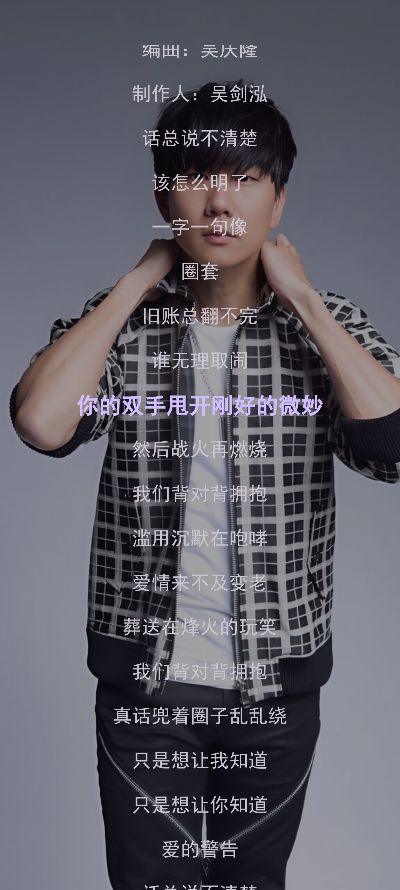
  
  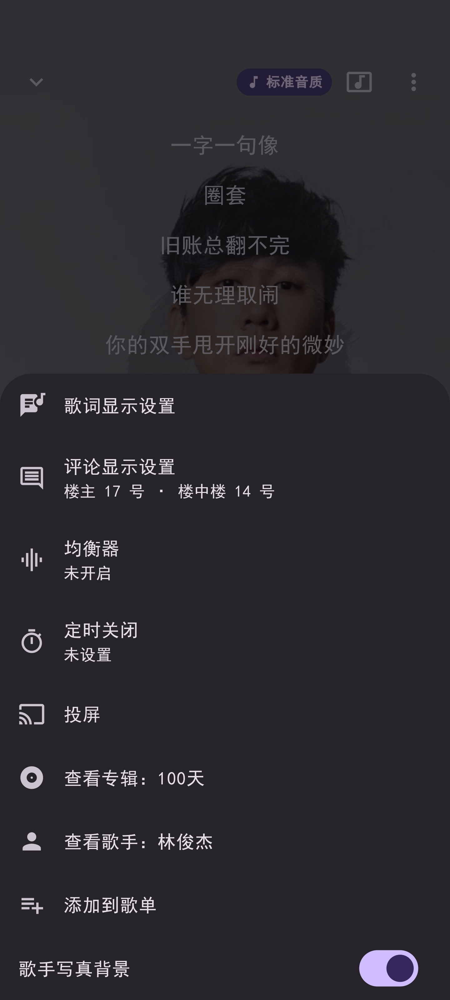
</p>

### 手机 · Apple Music 风格

<p align="center">
  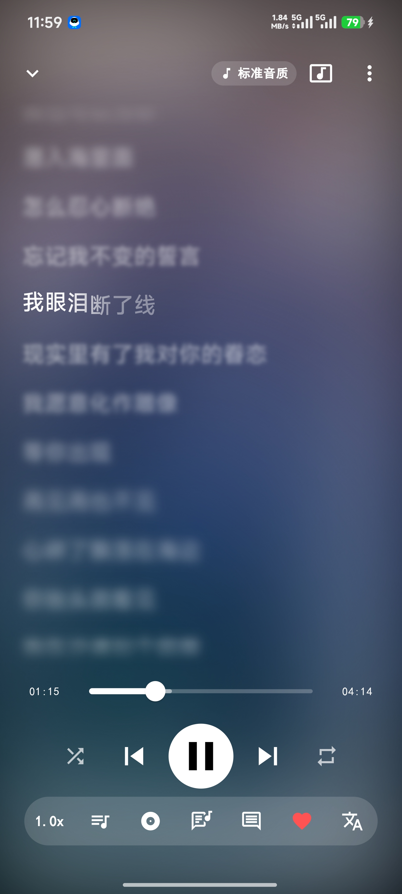
  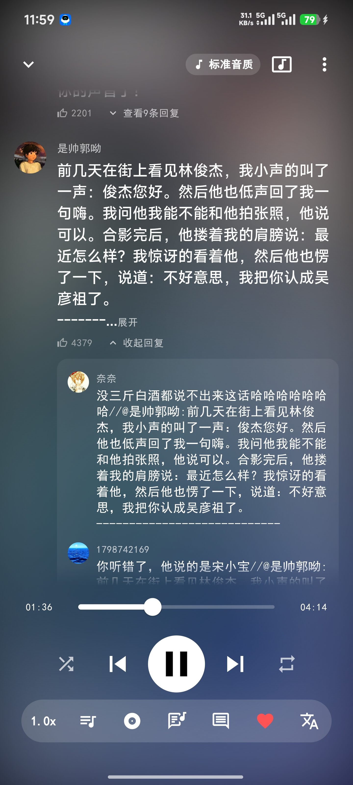
  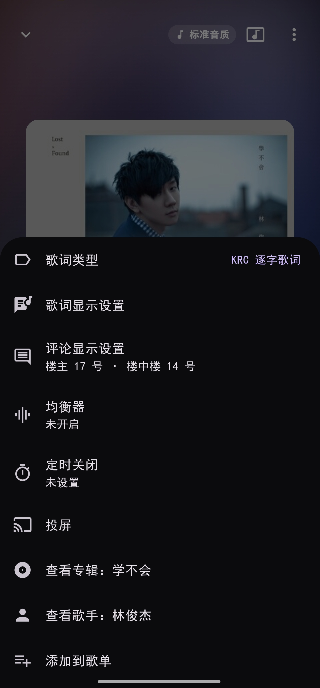
</p>

### 手机 · 更多界面

<p align="center">
  
  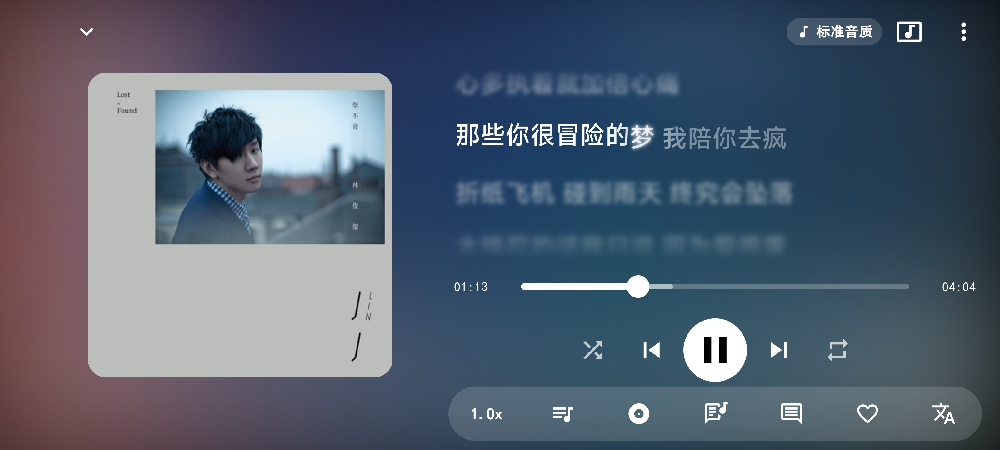
</p>


### 平板 · Apple Music 风格

<p align="center">
  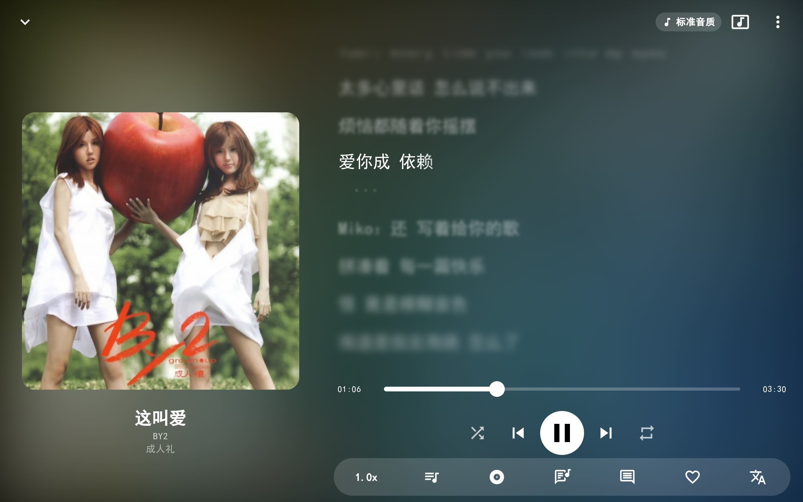
  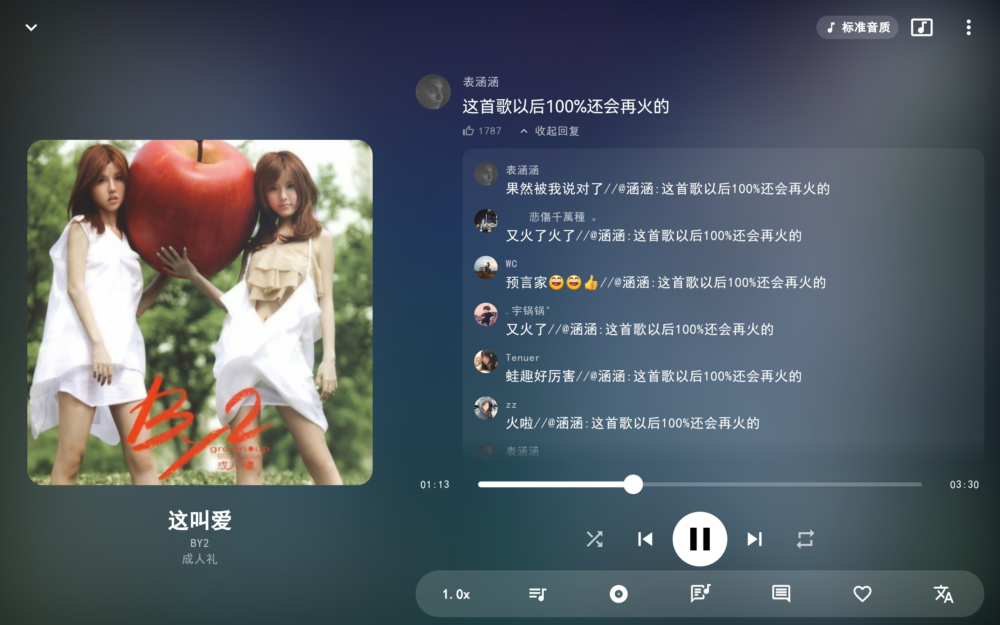
</p>


### 平板 · Material Design 3

<p align="center">
  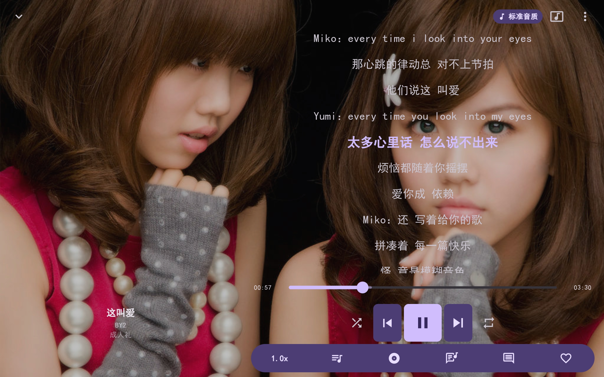
  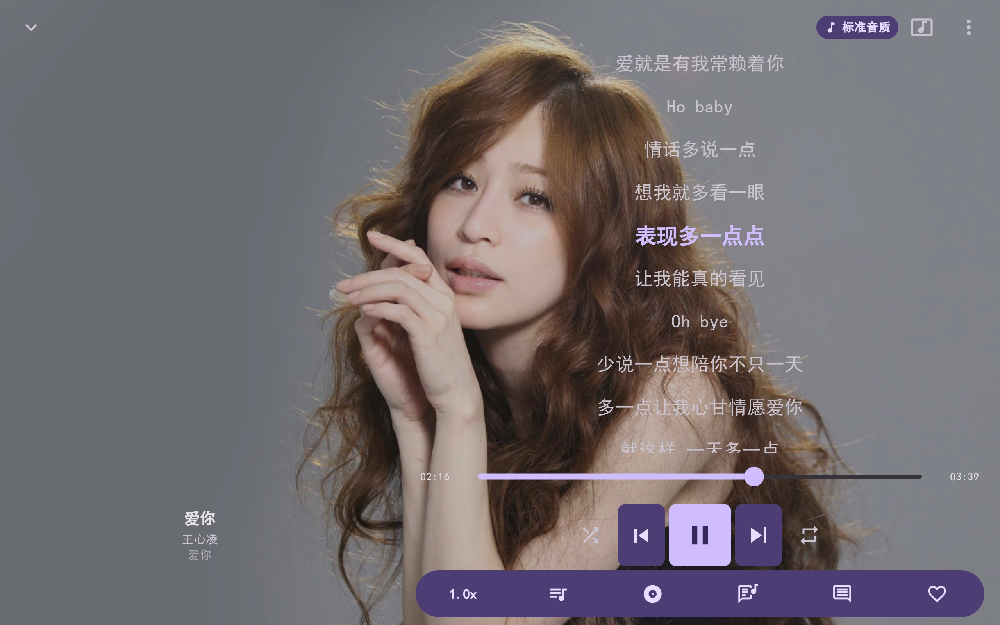
</p>

### 平板 · 更多界面

<p align="center">
  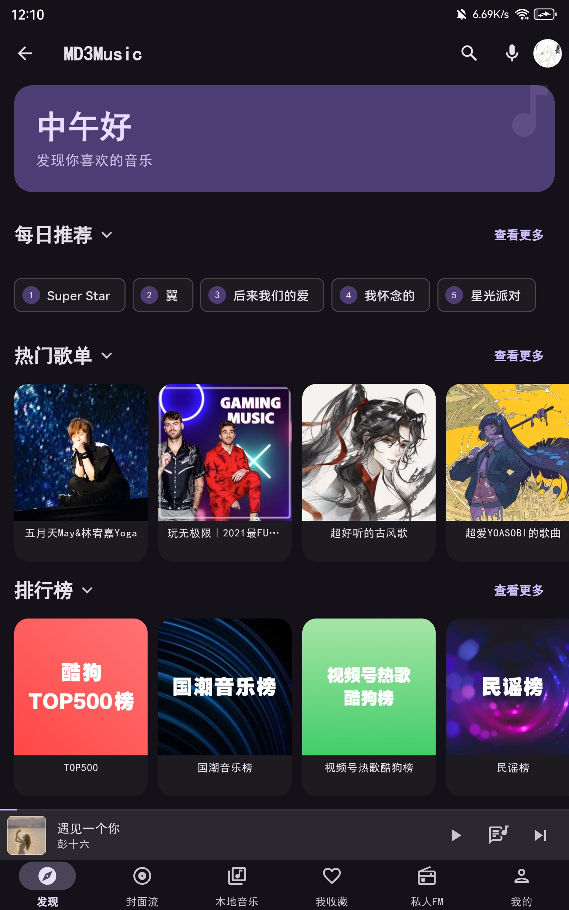
</p>
<p align="center">
  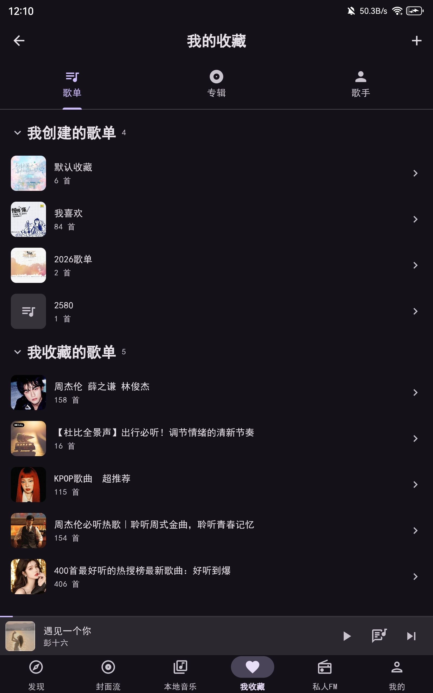
</p>
<p align="center">
  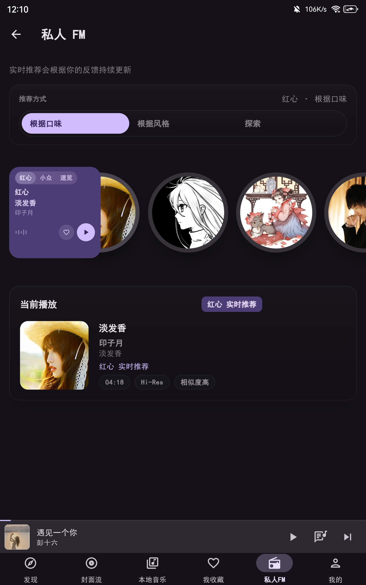
</p>


---


## 🚀 快速开始

### 前置要求

- **Flutter SDK** 3.12.0 或更高版本
- **Rust** 1.70+（用于构建嵌入式 API 服务器）
- **Android Studio** / VS Code
- **Android NDK** 28（用于 Rust 交叉编译）

### 1. 克隆项目

```bash
git clone https://github.com/zzyoxml/md3Music.git
cd md3Music
```

### 2. 安装 Flutter 依赖

```bash
flutter pub get
```

### 3. 构建 Rust 服务器（可选）

`libkugou_server.so` 已提交进 Git 仓库，通常无需重新编译。如果你修改了 `kugou_api_server/rust/src/` 下的代码，需要重新构建：

```bash
# 主机编译验证
cd kugou_api_server/rust
cargo build --release

# 安卓交叉编译（4 个 ABI，需要 NDK）
./build_android.sh
```

> **注意**：`libkugou_server.so`（arm64-v8a、armeabi-v7a、x86、x86_64）已包含在仓库中，修改服务器代码才需要重新编译。

### 4. 运行应用（调试模式）

```bash
# 连接 Android 设备后执行
flutter run
```

### 5. 构建发布版 APK

```bash
# 构建三个架构的 APK（分拆包）
flutter build apk --release --split-per-abi

# 输出位置：
# build/app/outputs/flutter-apk/app-armeabi-v7a-release.apk  (32位)
# build/app/outputs/flutter-apk/app-arm64-v8a-release.apk   (64位)
# build/app/outputs/flutter-apk/app-x86_64-release.apk      (模拟器)
```

---

## 📁 项目结构

```
md3Music/
├── lib/                        # Flutter 应用代码
│   ├── main.dart               # 应用入口
│   ├── app.dart                # 主应用组件
│   ├── core/                   # 核心模块
│   │   ├── layout/             # 响应式布局
│   │   ├── services/           # 平台服务（音频/USB 独占/均衡器/DLNA 投屏/频谱/桌面歌词/词幕/小组件）
│   │   ├── theme/              # 主题配置
│   │   └── utils/              # 工具类
│   ├── data/                   # 数据层
│   │   ├── models/             # 数据模型
│   │   └── repositories/       # 数据仓库（设置/收藏/历史）
│   ├── modules/                # 功能模块
│   │   ├── home/               # 主页（每日推荐等）
│   │   ├── launchpad/          # LaunchPad 导航
│   │   ├── discover/           # 发现页
│   │   ├── charts/             # 排行榜
│   │   ├── coverflow/          # 封面流（CoverFlow 3D）
│   │   ├── player/             # 播放器（含评论视图/MV 播放）
│   │   ├── playlist/           # 歌单详情
│   │   ├── search/             # 搜索
│   │   ├── album/              # 专辑详情
│   │   ├── artist/             # 歌手详情
│   │   ├── personal_fm/        # 私人 FM
│   │   ├── ip/                 # 编辑精选
│   │   ├── audiobook/          # 听书
│   │   ├── scene/              # 场景音乐
│   │   ├── channel/            # 频道
│   │   ├── brush/              # 刷刷（竖屏视频流）
│   │   ├── user/               # 用户中心（签到/收藏/历史/听歌排行）
│   │   ├── library/            # 音乐库（本地音乐/云盘）
│   │   ├── settings/           # 设置（含均衡器）
│   │   ├── login/              # 登录
│   │   ├── onboarding/         # 新手引导
│   │   └── recognition/        # 听歌识曲
│   ├── providers/              # 状态管理
│   ├── services/               # 服务层（本地 API 客户端 / 服务器启动）
│   └── widgets/                # 公共组件
│       └── apple_lyrics/       # Apple Music 风格歌词
├── kugou_api_server/           # 嵌入式 Rust API 服务器
│   ├── rust/                   # Rust crate（tiny_http + ureq）
│   │   ├── src/
│   │   │   ├── lib.rs          # FFI/JNI 导出符号
│   │   │   ├── server.rs       # HTTP 服务器：路由分发、CORS、缓存
│   │   │   ├── modules/        # 160+ 个 API 模块
│   │   │   ├── crypto.rs       # MD5/SHA1/AES/RSA 加密
│   │   │   ├── request.rs      # 上游转发（ureq）
│   │   │   └── device.rs       # 设备信息持久化
│   │   ├── tests/smoke.rs      # 本地冒烟测试
│   │   ├── build_android.sh    # 一键交叉编译脚本
│   │   └── Cargo.toml
│   └── module/                 # 旧 JS 模块（已废弃，仅供参考）
├── img/                        # 界面预览截图（README 用）
│   ├── phone/                  # 手机：md3 / applemusic / other
│   └── pad/                    # 平板：md3 / applemusic / other
├── assets/                     # 资源文件
│   ├── images/                 # 图片资源
│   └── fonts/                  # 字体文件
├── android/                    # Android 平台配置
│   └── app/src/main/
│       ├── cpp/                # USB 独占输出 C++ 驱动（CMake）
│       ├── kotlin/.../        # KugouApiService（启动本地服务器）/ MainActivity
│       └── jniLibs/           # libkugou_server.so（四个架构）
└── pubspec.yaml                # Flutter 配置
```

---

## 🛠️ 技术栈

| 类别 | 技术 |
|------|------|
| **UI 框架** | Flutter 3.12+ |
| **状态管理** | Provider |
| **动效** | m3e_core（M3 Expressive Motion） |
| **音频播放** | just_audio + just_audio_background |
| **音频焦点** | audio_session |
| **网络请求** | Dio |
| **本地存储** | SharedPreferences + SQLite |
| **图片缓存** | cached_network_image |
| **嵌入式服务器** | Rust（tiny_http + ureq） |
| **加密** | rsa / aes / md-5 / sha1 / sha2 |
| **元数据读取/写入** | audio_metadata_reader + JAudioTagger (MP3/FLAC/M4A) |
| **DLNA 投屏** | dlna_dart |
| **MV 播放** | video_player + chewie |
| **USB 独占输出** | 原生 JNI + CMake C++（usbdevfs） |
| **取色** | palette_generator + dynamic_color + material_color_utilities |
| **桌面歌词** | Lyricon Provider |
| **听歌识曲** | record（录音）+ Rust PCM 预处理 |
| **原生通知** | fluttertoast（Toast） |
| **文件/权限** | permission_handler + path_provider |
| **桌面快捷方式** | quick_actions |
| **音频均衡器** | just_audio 平台均衡器 |
| **音乐源** | 酷狗音乐 API |

---

## ⚙️ 配置说明

### 嵌入式服务器

应用启动时会自动启动本地 Rust 服务器（`libkugou_server.so`），监听 `127.0.0.1` 的**随机端口**（10000~60000，被占用自动更换），实际端口由服务器启动后回传给应用。无需任何配置。

### 音质设置

| 音质 | 格式 | 比特率 |
|------|------|--------|
| 标准 | MP3 | 128 kbps |
| 高质 | MP3 | 320 kbps |
| 无损 | FLAC | ~1000 kbps |
| Hi-Res | FLAC/MKV | ~2000+ kbps |

---

## 🔧 常见问题

### Q: 应用启动后无法搜索或播放音乐？

**A:** 检查日志确认 Rust 服务器是否成功启动。可以在 Android Studio Logcat 中搜索 "KugouApiService" 查看启动日志。

### Q: 登录功能无法使用？

**A:** 登录/注册/验证码已全部本地化：由嵌入式 Rust 服务器直连酷狗官方接口处理，不再依赖第三方云端。请确保设备可正常联网，并在 Logcat 中搜索 `KugouApiService` 确认本地服务器已成功启动。

### Q: 如何修改 API 服务器代码？

**A:**
1. 修改 `kugou_api_server/rust/src/` 目录下的 Rust 代码
2. 运行 `cd kugou_api_server/rust && cargo build --release` 编译验证
3. 安卓侧需交叉编译：`./build_android.sh`
4. 重新编译 App

### Q: 为什么 Rust 服务器需要 NDK？

**A:** Rust 的 TLS 依赖（`ring` crate）需要交叉编译为 Android 平台的 `.so` 文件。NDK 提供了 `aarch64-linux-android-clang` 等交叉编译工具链。

---

## 📝 开发说明

### 修改嵌入式服务器代码

1. 修改 `kugou_api_server/rust/src/` 目录下的 Rust 源代码
2. 主机编译验证：
   ```bash
   cd kugou_api_server/rust
   cargo build --release
   cargo test        # 运行测试
   cargo clippy      # 静态检查
   ```
3. 安卓交叉编译（需要 NDK）：
   ```bash
   ./build_android.sh
   ```
4. 重新编译 App

### 添加新 API 模块

在 `kugou_api_server/rust/src/modules/` 下新建 `.rs` 文件，实现对应的 API 端点处理函数，然后在 `server.rs` 中注册路由即可。

### 调试 API 服务器

如果想在本地调试 API 服务器（不嵌入 App）：

```bash
cd kugou_api_server/rust
cargo test          # 本地测试（不依赖外网）
```

---

##  致谢

感谢以下项目的支持：

- [EchoMusic](https://github.com/hoowhoami/EchoMusic) - UI 设计和架构参考
- [apple-music-like-lyrics](https://github.com/amll-dev/applemusic-like-lyrics) - Apple Music 风格逐字歌词渲染参考
- [Reorderable](https://github.com/Calvin-LL/Reorderable) - 播放列表面板长按拖拽排序
- [MaterialKolor](https://github.com/jordond/MaterialKolor) - 莫奈取色 / Material Design 3 动态配色
- [KuGouMusicApi](https://github.com/MakcRe/KuGouMusicApi) - API 代理服务
- [tiny_http](https://github.com/tiny-http/tiny-http) - Rust HTTP 服务器
- [ureq](https://github.com/algesten/ureq) - Rust HTTP 客户端
- [JAudioTagger](https://www.jthink.net/jaudiotagger/) - 音频元数据读写
- [decent-player](https://github.com/Ma145/decent-player) - USB 独占音频输出（DAC 独占驱动 C++/Kotlin 移植自其 `decent-usb-audio-driver`）

---

## 📄 许可证

本项目采用 [GNU AGPL-3.0](LICENSE) 许可证。

---

</div>

---

<div align="center">

**Made with ❤️ by zzyoxml and Little-White3110 、 Lyon、Saul-Soul**

</div>
